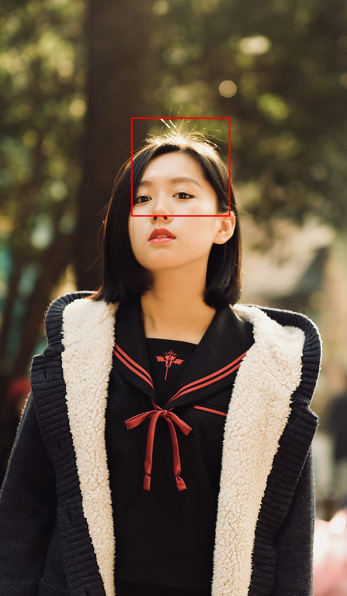

# Rizz Rater
### A python library that provides a basic API for a local ML face attractiveness rating model 

Just input an image:  

And then it'll identify the face:  

Then, using that it'll crop out the face and resize it to `350x350` so that it can be fed into the [model](https://github.com/gustavz/AttractiveNet):  

Finally, it'll give us the result, which in this case is:
### 7.033928871154785/10
Note: The model is biased towards east asian and caucasian individuals due to its [model](https://github.com/gustavz/AttractiveNet)'s [dataset](https://arxiv.org/pdf/1801.06345)

The model used for this library is from here: https://github.com/gustavz/AttractiveNet
The dataset used for the model is from here: https://arxiv.org/pdf/1801.06345
